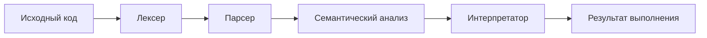
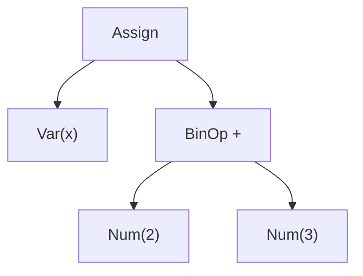
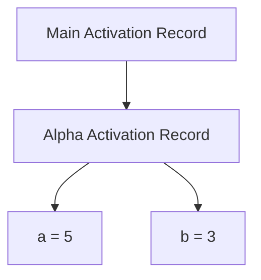
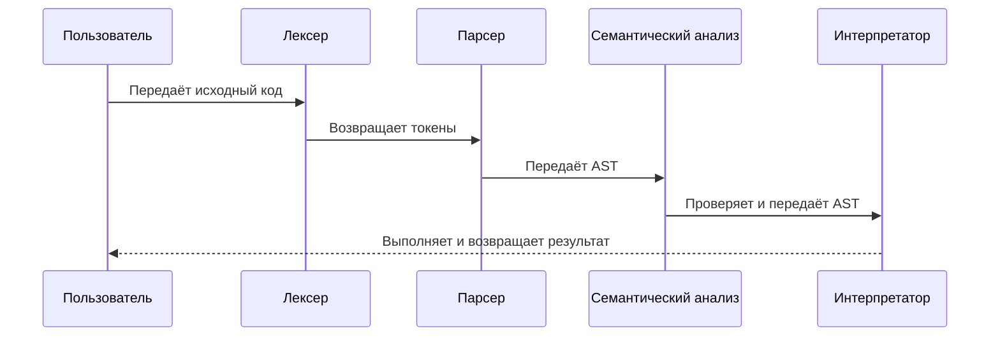
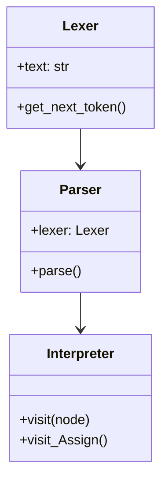

## Исследование предметной области
### Что такое процедура?

* Процедура — это именованный блок кода, который может быть вызван из других частей программы. Процедуры могут принимать параметры и имеют собственную область видимости для переменных.
Активационная запись (Activation Record)

* Активационная запись — это структура данных, содержащая информацию о текущем вызове процедуры, включая значения параметров и локальных переменных. Она используется для управления областью видимости и поддержания стека вызовов.
Ruslan's Blog

## Этапы изучения создания интерпретатора
### Изучение лексического анализа (лексер / токенизатор)

Цель: Преобразовать исходный код (строку) в последовательность токенов — базовых элементов языка (ключевые слова, числа, операторы и т.д.).
Пример:

```pascal
BEGIN
  x := 2 + 3;
END.
```

Лексер превращает это в:
```text
[
  Token(BEGIN), 
  Token(ID, 'x'), 
  Token(ASSIGN), 
  Token(INTEGER, 2),
  Token(PLUS),
  Token(INTEGER, 3),
  Token(SEMI),
  Token(END),
  Token(DOT)
]
```

Пример кода:
```python
class Lexer:
    def __init__(self, text):
        # client string input, e.g. "4 + 2 * 3 - 6 / 2"
        self.text = text
        # self.pos is an index into self.text
        self.pos = 0
        self.current_char = self.text[self.pos]
        # token line number and column number
        self.lineno = 1
        self.column = 1
    
    ...

    def get_next_token(self):
        """Lexical analyzer (also known as scanner or tokenizer)

        This method is responsible for breaking a sentence
        apart into tokens. One token at a time.
        """
        ... # Преобразование символов в токены
        return Token(type=TokenType.EOF, value=None)
```


### Изучение синтаксического анализа (парсинг)

Цель: Преобразовать токены в дерево разбора (AST — Abstract Syntax Tree), которое отражает структуру кода.
Пример:

Код: `x := 2 + 3`
AST:
```
Assign
├── Variable(x)
└── BinOp
    ├── Num(2)
    ├── PLUS
    └── Num(3)
```

Пример кода:
```python
class BinOp(AST):
    def __init__(self, left, op, right):
        self.left = left
        self.token = self.op = op
        self.right = right
```

### Изучение семантического анализа

Цель: Проверить корректность кода: существуют ли переменные, правильно ли используются типы и процедуры.
Пример:

`x := y + 5;  // ошибка, если y не определена`

Пример кода:
```python
class SemanticAnalyzer(NodeVisitor):
    def __init__(self):
        self.current_scope = None

    ...

    def visit_Block(self, node):
        for declaration in node.declarations:
            self.visit(declaration)
        self.visit(node.compound_statement)
```

### Выполнение кода (интерпретация)

Цель: Выполнить код, обходя AST, сохраняя значения переменных и выполняя выражения.

## Схема работы интерпретатора



```python
class Interpreter(NodeVisitor):
    def __init__(self, tree):
        self.tree = tree
        self.call_stack = CallStack()
        
    ...

    def visit_Block(self, node):
        for declaration in node.declarations:
            self.visit(declaration)
        self.visit(node.compound_statement)
```


## Дополнительные схемы

### AST для выражения `x := 2 + 3`


### Схема стека вызова с процедурами (пример)


### Последовательность обработки кода




### UML диаграмма классов ключевых компонентов

